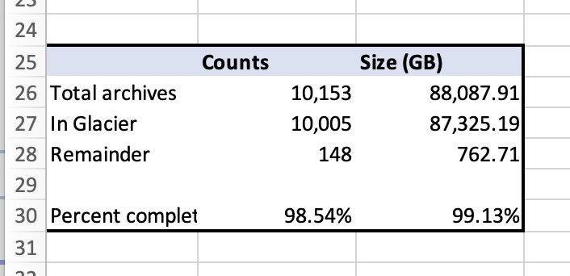

# Guardian queuing

Scripts to generate todo files for guardian processes for manuscripts on OPenn,
to deploy `todo` files to guardian servers, and to start, manage and collect
data on  guardian jobs.

## Scripts in this project

- `openn_sizes.rb` -- to be run on OPenn server, get sizes of items newly added
  to OPenn
- `create_todos.rb` -- create `todo` files from an OPenn sizes CSV; this script
  runs:
    - `build_inventory.rb` -- generate YML input for `guardian_manifest`
    - `guardian_manifest` (pulled from gitlab) -- generate manifest CSV from
      inventory.yml
    - `csv_to_yml` (pulled from gitlab) -- generate `todo` files from manifest
      CSV
    - `sort_todo_files.rb` -- use `sizes.csv` to rename `todo` files with group
      and serial number
- `push_todos.rb` -- deploy tar-gzipped `todo` files from `create_todos.rb` to
  a guardian server
- `guardian_run.rb` -- remote commands to run a group of `todo` files on a
  guardian server
- `guardian_jobs.rb` -- check the status of `todo` file jobs running on
  guardian servers
- `guardian_ps.rb` -- check that guardian processes are running on guardian
  servers; runs `docker ps`
- `guardian_statuses.rb` -- retrieve CSV-formatted data on guardian `todo` jobs
  by status: sucess, failed, etc.
- `order_walters_archives.rb` -- assign Walters ms objects to groups based on
  size
- `split_by_size.rb` -- assign objects to groups (A, B, C, etc.) based on size

# Adding new MS objects to guardian

## TL;DR version

1. Run `openn_sizes.rb` on the openn server to generate `sizes.csv`; then 
   - copy output `sizes.csv` to local server;
   - add rows from `sizes.csv` to "Glacier Priorities.xlsx", "Guardian Sizes" 
     sheet; and
   - use `sizes.csv` in step #2. 
2. Run `create_todos.rb sizes.csv` on the local server to generate the new 
   `todos`.
3. Run `push_todos.rb` to deploy each group of `todo` files (LARGE, A, B, C) to
   a guardian server.
4. Run `guardian_run.rb` to start the guardian process for a group of `todo` 
   files on a guardian server.

## All the steps explained

### Adding new repositories to the list

On the OPenn server, run `openn_sizes.rb` to get the CSV of new items to add to
the Guardian Sizes sheet of the Guardian Priorities.xlsx file.

Before you run the script save the current Guardian Size sheet from the
Guardian Priorities.xlsx workbook as

- `data/Glacier_Priorities-Glacier_sizes.csv`

Add any folders that have been renamed to the file `data/renamed_folders.csv`.
This file is used to make sure duplicate content isn't uploaded under a new 
name.

Set the `OPENN_ROOT_DIR` environment variable. This is the local directory that
serves as the OPenn site root directory. 

Run the script:

```
OPENN_ROOT_DIR=/path/to/OPenn ruby scripts/openn_sizes.rb > sizes.csv
```

Now add the new objects to the Glacier Sizes worksheet.

- Copy `sizes.csv` to your local computer.
- Create a new empty Excel workbook and *import the `sizes.csv` into it setting
  all columns to text*.
- Copy all rows _except for the header_.
- Add the new rows to the end of the Guardian Priorities/Guardian Sizes sheet; 
  *NB use Paste Special... > Values*.
- Extend formulas in columns *In Glacier* and *Size in Glacier* to the new last
  row of data.

Retain `sizes.csv` to generate and order `todo` files in the following steps. 

### Create new todos

Using the `sizes.rb` from the OPenn server, run `create_todos.rb`:

```shell
ruby scripts/create_deploy_todos.rb sizes.csv
```

This script will:

- Run `build_inventory.rb` to generate YML input for `guardian_manifest`.
- Run `guardian_manifest` (pulled from gitlab) to generate manifest CSV from
  inventory YAML files.
- Run `csv_to_yml` (pulled from gitlab) to generate `todo` files from manifest
  CSV.
- Run `sort_todo_files.rb` to rename `todo` files with group and serial number
  using group information from `sizes.csv`.
- Tar-gzip the todos to a timestamped file in the `tmp` directory.

### Push todos to the guardian servers

For example, if `create_todos.rb` creates the file
`tmp/todo-20210203T1558EST.tgz`, you would run the following to push the `C`
group of `todo` files to the guardian02 server.

```
ruby scripts/push_todos.rb g02 C tmp/todo-20210203T1558EST.tgz
```

Run this command for each group/guardian server combination. Running help on
`push_todos.rb` shows the known combinations:

```
$  ruby scripts/push_todos.rb -h
Please enter a valid SERVER
Usage: push_todos.rb SERVER GROUP TODOS_TGZ

Servers:  g01, g02
   g01: {:host=>"guardian01.library.upenn.int", :groups=>["LARGE", "A"]}
   g02: {:host=>"guardian02.library.upenn.int", :groups=>["B", "C"]}

```

See below for host/group combination configuration.

### Start the guardian jobs

Use the `guardian_run.rb` script to start guardian jobs on the remote servers.
For example, to start processing group 'A' on the `guardian01` server you would
do the following.

```
ruby scripts/guardian_run.rb g01 A
```

Run this command for each group/guardian server combination. Running help on
`guardian_run.rb` shows the known combinations:

```
ruby scripts/guardian_run.rb -h
Please enter a valid SERVER
Usage: guardian_run.rb SERVER GROUP

Servers:  g01, g02
   g01: {:host=>"guardian01.library.upenn.int", :groups=>["LARGE", "A"]}
   g02: {:host=>"guardian02.library.upenn.int", :groups=>["B", "C"]}

```

## Get information on completed jobs

Run `guardian_statuses.rb` to collect the list of successfully completed jobs on 
the guardian servers. This will collect information from all four servers.

```
ruby scripts/guardian_statuses.rb success > junk.csv  
wc -l junk.csv
9541 junk.csv
```

1. Open the CSV file generated by the process in Excel.
2. **Sort** by the `time` column. 
3. Copy sorted rows from CSV file
4. **Starting at row 485** on the Completed tab of the Glacier Priorities 
   spreadsheet, paste in the copied the copied rows.
   
Summary appears on the Totals tab of the Glacier Priorities spreadsheet; thus,



# Host and group configuration

Host and group combinations are configured in the `lib/hosts.rb` file:

```ruby
HOSTS = {
    g01: {
        host:   'guardian01.library.upenn.int',
        groups: %w{ LARGE A }
    },
    g02: {
        host:   'guardian02.library.upenn.int',
        groups: %w{ B C }
    }
}
```
